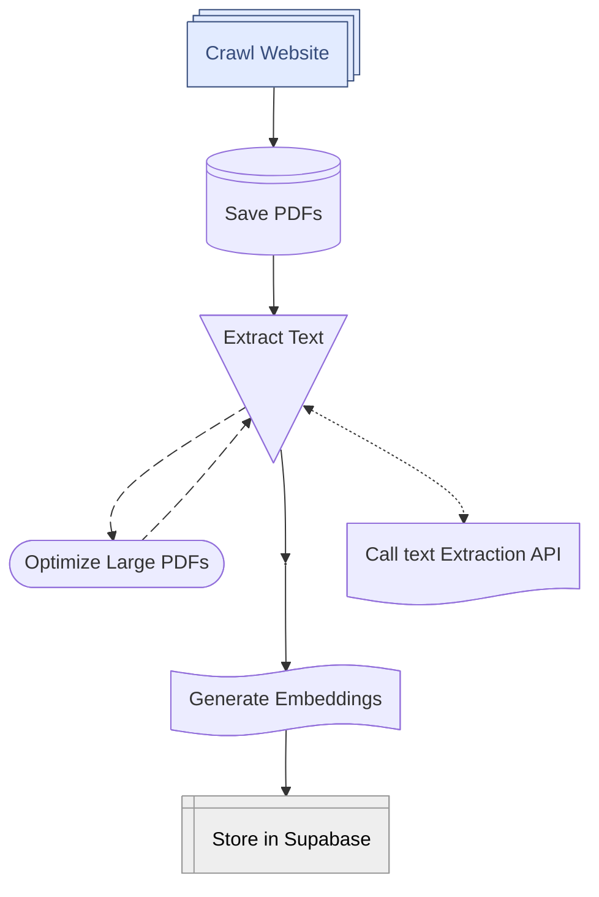

# DBT Chatbot Crawler Pipeline 

This project crawls a website, saves each page as a PDF, extracts text from the PDFs, generates OpenAI embeddings, and stores the results in Supabase for search and analysis.

## Project Structure

- `main.py` — Orchestrates the workflow.
- `crawl_and_save_pdfs.py` — Crawls the website and saves each page as a PDF.
- `extract_text.py` — Extracts text from PDFs, optimizes large PDFs if needed.
- `embed_and_store.py` — Embeds extracted text using OpenAI and stores it in Supabase.
- `utils.py` — Shared helper functions.
- `config.py` — Stores API keys and configuration variables (**not tracked in git; you must create this file**).

## Workflow



## Setup

1. **Clone the repository**
2. **Install dependencies**
   ```bash
   pip install -r requirements.txt
   ```
3. **Create a `config.py` file in the project root**
   - This file should contain your `SUPABASE_URL`, `SUPABASE_KEY`, and `OPENAI_API_KEY` variables. Example:
     ```python
     SUPABASE_URL = "your_supabase_url"
     SUPABASE_KEY = "your_supabase_key"
     OPENAI_API_KEY = "your_openai_api_key"
     ```
   - **Note:** `config.py` is not tracked by git for security reasons.

## Running the Pipeline

Run the entire workflow:
```bash
python main.py
```

This will:
1. Crawl the target website and save PDFs to `output_pdf/`
2. Extract text from PDFs to `extract_text/` (optimizing large PDFs as needed)
3. Generate embeddings and store them in Supabase

## Running Steps Individually

You can also run each step separately by importing and calling the relevant functions from each module.

## Requirements
- Python 3.8+
- See `requirements.txt` for Python dependencies

## License
MIT 
